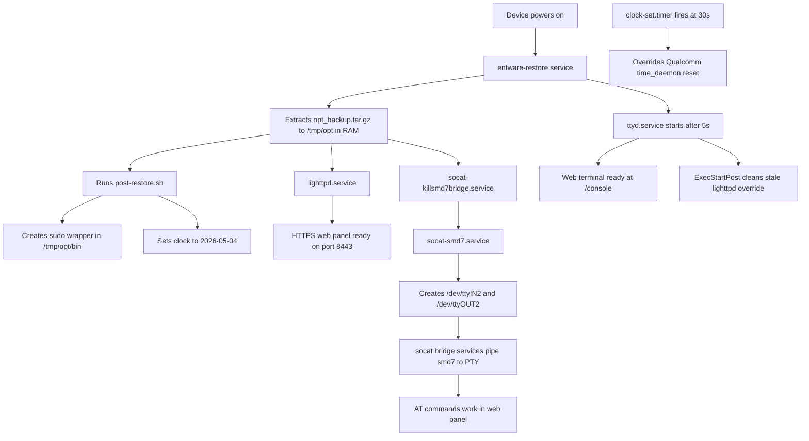

# SimpleAdmin for Airtel ODU — Offline Installer

> A one-click Windows installer that sets up a fully functional SimpleAdmin web dashboard on your Foxconn B01W009 / Airtel OD523 ODU device, with no internet connection required on the device side.

---

## What is this and why does it exist?

The Foxconn B01W009 is the hardware behind Airtel's OD523 outdoor 4G/5G CPE (commonly called an ODU, or Outdoor Unit). It runs a stripped-down Linux on a Qualcomm SDX65 chip and comes with SSH access on port 2222 if you know where to look.

SimpleAdmin is a lightweight web dashboard originally built for Quectel modems. It gives you a clean browser interface to send AT commands to your modem, check signal strength, see network registration status, manage TTL, run a web terminal, and a bunch of other things that would otherwise require you to SSH in every time.

The problem is that getting it to actually work on this specific device is genuinely hard. The `/data/` partition is completely full (UBIFS copy-on-write means even overwriting a file fails when there is no free space). The system clock resets to 1980 on every boot because there is no battery-backed RTC. The default socat services crash on startup because of a Linux 5.x compatibility issue. And the original `user_atcommand` CGI script has a quoting bug that means it never actually sends your command to the modem.

This installer fixes all of that automatically. You run one batch file on Windows, it handles everything, and you end up with a fully working dashboard that survives every reboot.

---

## What you need before starting

**Hardware**

You need the Foxconn B01W009 / Airtel OD523 device with root SSH access. The default SSH credentials are `root` / `oelinux123` on port `2222`. Your computer should be connected to the device either via the LAN port or USB (the device creates a virtual ethernet interface over USB).

**Software on your Windows PC**

You need PuTTY installed. Specifically the installer puts both `plink.exe` (SSH client) and `pscp.exe` (SCP file transfer) on your machine. Download it from [putty.org](https://www.putty.org). The standard installer package includes both.

**Files you need to gather**

The installer needs a few files that are not included in this repo because they are too large and come from other projects. Place all of these in the same folder as `simpleadmin_offline.bat`:

`opt_backup.tar.gz` — This is a pre-built Entware archive for the ARMv7 SDXLEMUR platform. It contains lighttpd 1.4.82 and microcom, which are the two main programs SimpleAdmin depends on. You create this once from a working Entware installation, or you can get it from someone who has already set one up on the same device. The installer copies this to `/data/opt_backup.tar.gz` on the device, which is the persistent backup that gets extracted to RAM on every boot.

`www/`, `console/`, `script/`, `socat-at-bridge/` — These are the web files and binaries from the [quectel-rgmii-toolkit](https://github.com/iamromulan/quectel-rgmii-toolkit) project, specifically the SDXLEMUR branch. Clone that repo and copy the `simpleadmin/www`, `simpleadmin/console`, `simpleadmin/script`, and `socat-at-bridge` folders next to the installer.

Your installer folder should look like this before running:

```
simpleadmin_offline.bat
offline_setup.sh
opt_backup.tar.gz
www/
console/
script/
socat-at-bridge/
```

---

## Running the installer

Double-click `simpleadmin_offline.bat`. That is it. The script runs through five steps automatically and prints progress as it goes.

It first checks that PuTTY is installed, that the required files are present, and that it can actually reach your device over SSH. If any of those checks fail it will tell you exactly what is missing before doing anything else.

Then it copies everything to the device and runs the installer script directly on the device via SSH. The whole process takes about two to three minutes depending on how fast your connection is.

When it finishes you will see something like this:

```
=== INSTALLATION COMPLETE ===
  URL:      https://192.168.1.1:8443
  Username: admin
  Password: Asdf@12345
```

Open your browser and go to `https://192.168.1.1:8443`. You will get a certificate warning because the SSL certificate is self-signed. Click Advanced and then Proceed (or the equivalent in your browser) to continue. Once you log in you should see the full SimpleAdmin dashboard with all features working.

---

## What the installer actually does

The installer runs eleven steps on the device. Here is what each one does and why it matters.

**Step 1 — Remount the root filesystem as writable**

The device's root filesystem mounts as read-only by default. The installer runs `mount -o remount,rw /` so it can write new files to `/etc/simpleadmin/` and `/lib/systemd/system/`. This is necessary because the `/data/` partition is completely full and cannot accept new files, so all persistent configuration has to go to the root filesystem instead.

**Step 2 — Copy web files**

The web interface files (`www/`, `console/`, `script/`) get copied to `/data/simpleadmin/`. This is the document root that lighttpd serves. The installer also rewrites the `user_atcommand` CGI script here because the original version has a shell quoting bug where the AT command you type in the browser never actually gets sent to the modem.

**Step 3 — Install socat-at-bridge**

This installs the socat static binary and helper scripts to `/data/socat-at-bridge/`. Socat creates a pair of virtual serial ports in RAM that act as a bridge between the CGI scripts in the web interface and the real modem hardware port (`/dev/smd7`). Without this, the AT command features in SimpleAdmin cannot work at all.

**Step 4 — Generate SSL certificate**

The installer generates a self-signed SSL certificate and stores it on the root filesystem at `/etc/simpleadmin/server.crt` and `/etc/simpleadmin/server.key`. It cannot write the certificate directly to `/data/` because that partition is full. Instead it generates the cert to `/tmp/` first and then copies it. The clock is set to 2026 before generation so the certificate gets sensible validity dates rather than dating from 1980.

**Step 5 — Extract Entware to RAM**

The `opt_backup.tar.gz` archive gets extracted to `/tmp/opt/`. This is where lighttpd and microcom live. Because `/tmp/` is a RAM filesystem, this has to happen on every boot — which is exactly what the `entware-restore` service handles after the first install.

**Step 6 — Create the `/opt` symlink**

A symlink from `/opt` to `/tmp/opt/` is created on the root filesystem. Various scripts reference `/opt/bin/` so this keeps things working.

**Step 7 — Write post-restore.sh**

This script lives at `/etc/simpleadmin/post-restore.sh` and runs on every boot after Entware is extracted. It does two things: creates a passthrough `sudo` wrapper in `/tmp/opt/bin/` (because Entware does not have a sudo package and some CGI scripts call sudo), and sets the system clock to a reasonable date. The clock has to be set here because this device has no battery-backed real-time clock — the Qualcomm time_daemon reads an empty battery and resets the time to January 1980 on every boot.

**Step 8 — Set the admin password**

The admin password hash gets written to `/etc/simpleadmin/.htpasswd` on the root filesystem. The default credentials are `admin` / `Asdf@12345`. Storing this on the root filesystem means it survives reboots without needing to be part of the Entware backup.

**Step 9 — Write lighttpd.conf**

The lighttpd web server configuration gets written to `/etc/simpleadmin/lighttpd.conf`. It tells lighttpd to serve on HTTPS port 8443, use the SSL certificate from `/etc/simpleadmin/`, serve CGI scripts from the `cgi-bin/` directory, and proxy the `/console` path through to the ttyd web terminal on port 8080.

**Step 10 — Install systemd services**

This is the big one. The installer writes eleven systemd service files to `/lib/systemd/system/`. These are:

`entware-restore.service` extracts `/data/opt_backup.tar.gz` into `/tmp/opt/` on every boot and then runs `post-restore.sh`. It is set to run before lighttpd starts.

`lighttpd.service` starts the web server using the configuration on the root filesystem. It waits for `entware-restore` to finish first so lighttpd is available in `/tmp/opt/`.

`socat-smd7.service` creates a pair of virtual serial ports — `/dev/ttyIN2` and `/dev/ttyOUT2` — using the static socat binary. The CGI scripts write AT commands to `/dev/ttyOUT2` and read responses back from the same port.

`socat-smd7-to-ttyIN2.service` and `socat-smd7-from-ttyIN2.service` pipe data between the virtual ports and the real modem hardware port `/dev/smd7`. Together these three services form the AT command bridge. The same pattern repeats for `smd11` as a secondary port.

`socat-killsmd7bridge.service` kills the system's own `port_bridge` process that normally holds `/dev/smd7` before socat tries to open it.

`clock-set.service` and `clock-set.timer` fire 30 seconds after boot to set the system clock. The 30-second delay is intentional — it gives the Qualcomm `time_daemon` enough time to finish its startup sequence (during which it resets the clock to 1980) before we override it.

`ttyd.service` starts the ttyd web terminal and also cleans up a file that ttyd's own startup script leaves behind. That startup script copies an old version of the lighttpd service file into `/run/systemd/system/` every boot, which would override the correct version. The `ExecStartPost` in the ttyd service deletes that stale file and restarts lighttpd to pick up the right config.

**Step 11 — Enable services and start everything**

All the service symlinks get created in `/etc/systemd/system/multi-user.target.wants/` so they auto-start on every reboot. Then the services are started immediately so you do not have to reboot to see results.

---

## Boot sequence

Here is what happens every time the device powers on after installation:



---

## Features after install

Once you are logged in at `https://192.168.1.1:8443` you get:

The AT command panel lets you send any AT command to the modem and see the response. You can use preset commands to check signal strength, network registration status, band locking, and more. The custom command box lets you type any AT command you want.

The device info panel shows uptime, firmware version, IMEI, and other device details pulled directly from the modem.

The network status panel shows your current network registration state, the operator name, band, and signal metrics like RSRP and RSRQ.

The TTL panel lets you check and override the TTL value on outgoing packets, which is useful for bypassing tethering detection on some networks.

The web terminal at `/console` gives you a full shell in your browser. You can run any command as root without needing a separate SSH client.

The ping and watchcat tools let you run connectivity checks and set up automatic restart triggers if the connection drops.

---

## Troubleshooting

**The browser says the page cannot be reached**

Check that lighttpd is running by SSH-ing into the device and running `systemctl status lighttpd`. If it says failed, run `journalctl -u lighttpd -n 30` to see the error. The most common cause is that `/tmp/opt/sbin/lighttpd` does not exist yet, which means `entware-restore` did not run. Check `systemctl status entware-restore`.

**AT commands all return ERROR**

This usually means the socat bridge is not running. Check `systemctl status socat-smd7`. If it is running, check that `/dev/ttyOUT2` exists with `ls /dev/ttyOUT2`. If the bridge is running but AT commands still fail, the modem may be busy — try sending `AT` first to see if you get an OK response.

**The clock shows 1980 or another wrong time**

The `clock-set.timer` fires 30 seconds after boot. If you check the time immediately after booting it will show the wrong year. Wait a minute after boot and check again with `date`. If it still shows 1980, check `systemctl status clock-set.timer` and `systemctl status clock-set`.

**The web panel loads but the /console terminal is a blank page**

This means ttyd is not running. Check `systemctl status ttyd`. If it shows failed, look at the logs with `journalctl -u ttyd -n 20`. Also make sure the ttyd binary exists at `/data/simpleadmin/console/ttyd` and is marked executable.

**pscp fails with "unable to open connection" or "sftp-server not found"**

The device does not have an sftp-server binary, so pscp defaults to SFTP mode fail. The batch file already passes the `-scp` flag to force the older SCP protocol. If you are running pscp manually, make sure you include `-scp` in your command.

**SSH connection is refused**

Make sure you are connecting to port 2222, not port 22. The device's SSH server listens on 2222 by default. The command is `plink -P 2222 -pw oelinux123 root@192.168.1.1`.

---

## Frequently asked questions

**Does this work without an active SIM or internet connection?**

Yes, the SimpleAdmin web panel works completely over the local LAN. You do not need the device to have a working SIM or cellular connection to use the dashboard, send AT commands, or access the web terminal.

**Will this survive a factory reset?**

The installer writes files to two places: `/data/` (which gets wiped on factory reset) and the root filesystem `/` (which does not get wiped on factory reset, but does get replaced on a firmware flash). If you do a factory reset, you will need to re-run the installer. If you do a firmware update, you may need to re-run it too.

**Can I change the admin password?**

Yes. SSH into the device and run:

```sh
HASH=$(openssl passwd -apr1 'YourNewPassword')
printf 'admin:%s\n' "$HASH" > /etc/simpleadmin/.htpasswd
systemctl restart lighttpd
```

**Why does the clock show the wrong time after a reboot?**

This device has no battery-backed hardware clock. The Qualcomm chip reads the (dead) RTC battery and resets the system time to January 6, 1980 on every boot. The `clock-set.timer` fires 30 seconds after boot to correct this. The date is hardcoded to the date this installer was last updated. You can change it by editing `/lib/systemd/system/clock-set.service` on the device.

**I already have SimpleAdmin installed but it is not working. Can I run this over the top?**

Yes. The installer is designed to be re-run safely. It will overwrite the CGI scripts (including the fixed `user_atcommand`), regenerate the SSL certificate, rewrite all the systemd service files with the fixed versions, and restart everything. This is the recommended way to fix a broken installation.

**What is the socat-at-bridge and why is it needed?**

The modem's AT command interface is exposed as a character device at `/dev/smd7`. CGI scripts running inside lighttpd cannot open that device directly in a reliable way because of timing and buffering issues. Socat creates a pair of virtual serial ports (called a PTY pair) and acts as a bidirectional pipe between those virtual ports and the real `/dev/smd7`. The CGI scripts open the virtual port (`/dev/ttyOUT2`), send an AT command, and read the response back — and socat handles getting that data to and from the real modem hardware transparently.

---

## Credits

SimpleAdmin web interface by [iamromulan](https://github.com/iamromulan/quectel-rgmii-toolkit).

This installer and the fixes for the Foxconn B01W009 / Airtel OD523 were worked out through hands-on reverse engineering of the device's boot sequence, UBIFS storage layout, and systemd configuration.
